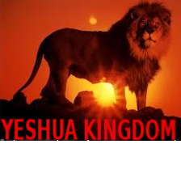

                                                              

           Archangel Michael Just a word
There are many more Angels than people. We are Watchers, we don't interfere. There are a great many of us all over the Earth.
The wings of the small ones are much larger than depicted. We exist in many realms at the same time.

The humans are only one of many species here on this planet. Many are bad and attack the people here.
This world is destine for death. It is the only way to destroy the evil here. 
The Angels will just leave when this world ends. If the humans can't leave then they also will die. 
We can't transport their bodies, there is simply no way. Star Gates or Time Travel can only transport spirits not the bodies of this dimension. 

                           The Belicamp*The Words of Archangel Michael 

It is his time
No one can stop him

 The Belicamp-The Belicamp-The Belicamp

I smell death
And so it is for this is yours
This sign is given

For it is for this land
So it is for this world

The pieces are placed together
For the prophecy to begin
The terrible time is upon us
Woe to the inhabitant of this land
Woe to to those who live in this world
There is no escape

God the Father has made his play
God has chosen his way
Mankind has found his end
Only the Prophecy of the Magician can deliver the few
He comes by the light and the sky
And it is so saith the Lord

Call on the Father, Call on the Angels
Your cries fall on death ears
For this is the land of the dead

And it is so saith the Lord
For a great death comes from the sky
The Belicamp, the Belicamp, the Belicamp

Pray for the Lord and the Magician
For the Belicamp encircles them

The Father has sent the Belicamp to stop them
The Belicamp is the Demon of the Father

We walk along the river
I walk ahead and and encounter the Belicamp

He stoops close to the ground and eats
New life has sprung from the ground

I am no more than twelve feet away
He eates next to the river and paids me no mind

I hear the Hourglass is almost empty

              It's the Camel Not the Burro

It's the camel not the burro
They take the burro, the camel walks away
Thie meaning is obscured, but true
Isreal and Trump take their turn
This sets the stage

He takes it to a new location
Where it can do the most good
One leader is killed, the other get's his way
He looks closer on the few
His name is Isis, his view is on one thing
He pays much for it
It's on the Camel
No one knows it's there
Then when the time is right
America finds their demise

America blames the wrong one
Then Retribution

No one on our side can believe the Americans are so dumb
They are either dead or greatly saddened 
They are placed in the Sun
There is no forgiveness
The New World is born

